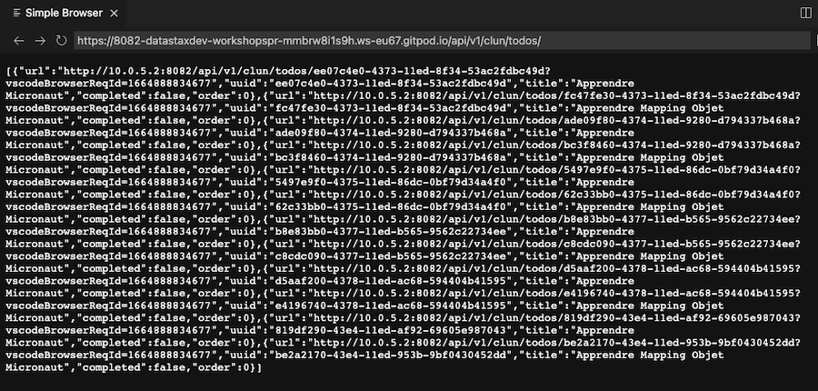

## 🎓 Spring, Quarkus and Micronaut with Apache Cassandra


[](http://www.apache.org/licenses/LICENSE-2.0)
[](https://discord.com/widget?id=685554030159593522&theme=dark)

Welcome to the *Explore SpringBoot, Quarkus and Micronaut microservices with NoSQL Apache Cassandra** workshop! In this two-hour workshop, we will show you a sample app architecture with data backed up on Apache Cassandra™ and program logic implemented on each of the three leading implementations of Java platform.

⏲️ **Duration :** 2 hours

🎓 **Level** Beginner to Intermediate


> [🔖 Accessing HANDS-ON](#-start-hands-on)

## 📋 Table of contents
- [Objectives](#objectives)
- [Frequently asked questions](#frequently-asked-questions)
- [Materials for the Session](#materials-for-the-session)
- [Setup your environment (DB, IDE)](#setup)
- [LAB1 - Understanding java drivers](#lab-1---understanding-java-drivers)
- [LAB2 - Spring Boot and Spring Data Cassandra](#lab-2---spring-data-cassandra)
- [LAB3 - Quarkus](#lab-3---cassandra-quarkus-extension)
- [LAB4 - Micronaut](#lab-4---micronaut-cassandra)
<p>

## Objectives

- 🎯 Give you an understanding and how and where to position Apache Pulsar

- 🎯 Give an overview of  streaming and datascience ecosystem**

- 🎯 Give you an understanding of Apache Cassandra NoSQL Database

- 🎯 Create your first pipeline with streaming and database.

- 🚀 Have fun with an interactive session

## Frequently asked questions

<p/>
<details>
<summary><b> 1️⃣ Can I run this workshop on my computer?</b></summary>
<hr>
<p>There is nothing preventing you from running the workshop on your own machine. If you do so, you will need the following:
<ol>
<li><b>git</b>
<li><b>Python 3.6+</b>
<li><b>Astra Cli</b>
<li><b>Pulsar Shell or Pulsar-Client</b>
</ol>
</p>
In this readme, we try to provide instructions for local development as well - but keep in mind that the main focus is development on Gitpod, hence <strong>we can't guarantee live support</strong> about local development in order to keep on track with the schedule. However, we will do our best to give you the info you need to succeed.
</details>
<p/>
<details>
<summary><b> 2️⃣ What other prerequisites are required?</b></summary>
<hr>
<ul>
<li>You will need enough *real estate* on screen, we will ask you to open a few windows and it would not fit on mobiles (tablets should be OK)
<li>You will need an Astra account: don't worry, we'll work through that in the following
<li>As "Intermediate level" we expect you to know what java and Spring are. 
</ul>
</p>
</details>
<p/>
<details>
<summary><b> 3️⃣ Do I need to pay for anything for this workshop?</b></summary>
<hr>
<b>No.</b> All tools and services we provide here are FREE. FREE not only during the session but also after.
</details>
<p/>
<details>
<summary><b> 4️⃣ Will I get a certificate if I attend this workshop?</b></summary>
<hr>
Attending the session is not enough. You need to complete the homework detailed below and you will get a nice badge that you can share on linkedin or anywhere else *(open badge specification)*
</details>
<p/>

## Materials for the session

It doesn't matter if you join our workshop live or you prefer to work at your own pace,
we have you covered. In this repository, you'll find everything you need for this workshop:

- [Slide deck](/slides/slides.pdf)
- [Discord chat](https://dtsx.io/discord)
- [Questions and Answers](https://community.datastax.com/)
- [Twitch backup](https://www.twitch.tv/datastaxdevs)

# 🏁 Start Hands-on

## Setup

#### `✅.setup-01`- Create your [Astra Account](https://astra.dev/yt-10-5)

> *ℹ️ Documentation:[Database creation guide](https://awesome-astra.github.io/docs/pages/astra/create-instance/#c-procedure)*

#### `✅.setup-02`- Create `Database Asministrator` Token.

>  *ℹ️ Documentation: [Token creation guide](https://awesome-astra.github.io/docs/pages/astra/create-token/#c-procedure)*.

```
Skip this step is you already have a token. You can reuse the same token in our other workshops, too. Your token should look like: `AstraCS:....`
```

|Field|Value|
|---|---|
|**Role**| `Database Administrator` |


#### `✅.setup-03`- Open Gitpod

Gitpod is an IDE based on VSCode deployed in the cloud.

> ↗️ _Right Click and select open as a new Tab..._

<a href="https://gitpod.io/#https://github.com/datastaxdevs/workshop-spring-quarkus-micronaut-cassandra"></a>


#### `✅.setup-04`- Setup Astra CLI

Go back to your gitpod terminal waiting for your token. Make sure you select the `database` shell in the bottom-right panel and provide the value where it is asked.

> 🖥️ `setup-04 output`
>
> ```
> [cedrick.lunven@gmail.com]
> ASTRA_DB_APPLICATION_TOKEN=AstraCS:AAAAAAAA
> 
> [What's NEXT ?]
> You are all set.(configuration is stored in ~/.astrarc) You can now:
>    • Use any command, 'astra help' will get you the list
>    • Try with 'astra db list'
>    • Enter interactive mode using 'astra'
> 
> Happy Coding !
> ```

#### `✅.setup-05`- Create database `workshops` and keyspace `ks_java` if they do not exist:

```bash
astra db create workshops -k ks_java --if-not-exist --wait
```

Let's analyze the command:
| Chunk         | Description     |
|--------------|-----------|
| `db create` | Operation executed `create` in group `db`  |
| `workshops` | Name of the database, our argument |
|`-k ks_java` | Name of the keyspace, a db can contains multiple keyspaces |
| `--if-not-exist` | Flag for itempotency creating only what if needed |
| `--wait` | Make the command blocking until all expected operations are executed (timeout is 180s) |

> **Note**: If the database already exist but has not been used for while the status will be `HIBERNATED`. The previous command will resume the db an create the new keyspace but it can take about a minute to execute.

#### `✅.setup-06`- Register token as env variable

```
export ASTRA_DB_APP_TOKEN=`astra config get default --key ASTRA_DB_APPLICATION_TOKEN`
echo ${ASTRA_DB_APP_TOKEN}
```

#### `✅.setup-07`- Download Secure bundle

- Download credentials in home folder

```
astra db download-scb workshops -f /workspace/workshop-spring-quarkus-micronaut-cassandra/secure-bundle-workshops.zip
```

- Check that the file is about `12k`
```
ls -l /workspace/workshop-spring-quarkus-micronaut-cassandra/
```

*Congratulations your environment is all set, let's start the labs !*

# LAB 1 - Understanding Java Drivers

#### `✅.1.a`- Connectivity

```
cd /workspace/workshop-spring-quarkus-micronaut-cassandra/lab1_cassandra_drivers
gp open /workspace/workshop-spring-quarkus-micronaut-cassandra/lab1_cassandra_drivers/src/main/java/com/datastax/samples/E00_TestConnectivity.java
mvn clean compile exec:java -Dexec.mainClass=com.datastax.samples.E00_TestConnectivity
```

#### `✅.1.b`- Create Schema

```bash
cd /workspace/workshop-spring-quarkus-micronaut-cassandra/lab1_cassandra_drivers
gp open /workspace/workshop-spring-quarkus-micronaut-cassandra/lab1_cassandra_drivers/src/main/java/com/datastax/samples/E01_CreateSchema.java
mvn clean compile exec:java -Dexec.mainClass=com.datastax.samples.E01_CreateSchema
```

#### `✅.1.c`- About Statements

```bash
cd /workspace/workshop-spring-quarkus-micronaut-cassandra/lab1_cassandra_drivers
gp open /workspace/workshop-spring-quarkus-micronaut-cassandra/lab1_cassandra_drivers/src/main/java/com/datastax/samples/E02_Statements.java
mvn clean compile exec:java -Dexec.mainClass=com.datastax.samples.E02_Statements
```

#### `✅.1.d`- CRUD

```bash
cd /workspace/workshop-spring-quarkus-micronaut-cassandra/lab1_cassandra_drivers
gp open /workspace/workshop-spring-quarkus-micronaut-cassandra/lab1_cassandra_drivers/src/main/java/com/datastax/samples/E03_OperationsCrudStatements.java
mvn clean compile exec:java -Dexec.mainClass=com.datastax.samples.E03_OperationsCrud
```

#### `✅.1.e`- Batches

```bash
cd /workspace/workshop-spring-quarkus-micronaut-cassandra/lab1_cassandra_drivers
gp open /workspace/workshop-spring-quarkus-micronaut-cassandra/lab1_cassandra_drivers/src/main/java/com/datastax/samples/E04_Batches.java
mvn clean compile exec:java -Dexec.mainClass=com.datastax.samples.E04_Batches
```

#### `✅.1.f`- Paging

```bash
cd /workspace/workshop-spring-quarkus-micronaut-cassandra/lab1_cassandra_drivers
gp open /workspace/workshop-spring-quarkus-micronaut-cassandra/lab1_cassandra_drivers/src/main/java/com/datastax/samples/E05_Paging.java
mvn clean compile exec:java -Dexec.mainClass=com.datastax.samples.E05_Paging
```

#### `✅.1.g`- Collections: List,Set,Map,Udt

```bash
cd /workspace/workshop-spring-quarkus-micronaut-cassandra/lab1_cassandra_drivers
gp open /workspace/workshop-spring-quarkus-micronaut-cassandra/lab1_cassandra_drivers/src/main/java/com/datastax/samples/E06_ListSetMapAndUdt.java
mvn clean compile exec:java -Dexec.mainClass=com.datastax.samples.E06_ListSetMapAndUdt
```

#### `✅.1.h`- Working with Json

```bash
cd /workspace/workshop-spring-quarkus-micronaut-cassandra/lab1_cassandra_drivers
gp open /workspace/workshop-spring-quarkus-micronaut-cassandra/lab1_cassandra_drivers/src/main/java/com/datastax/samples/E07_Json.java
mvn clean compile exec:java -Dexec.mainClass=com.datastax.samples.E07_Json
```

#### `✅.1.i`- Asynchronous Programming

```bash
cd /workspace/workshop-spring-quarkus-micronaut-cassandra/lab1_cassandra_drivers
gp open /workspace/workshop-spring-quarkus-micronaut-cassandra/lab1_cassandra_drivers/src/main/java/com/datastax/samples/E08_Async.java
mvn clean compile exec:java -Dexec.mainClass=com.datastax.samples.E08_Async
```

#### `✅.1.j`- Reactive Programming

```bash
cd /workspace/workshop-spring-quarkus-micronaut-cassandra/lab1_cassandra_drivers
gp open /workspace/workshop-spring-quarkus-micronaut-cassandra/lab1_cassandra_drivers/src/main/java/com/datastax/samples/E09_Reactive.java
mvn clean compile exec:java -Dexec.mainClass=com.datastax.samples.E09_Reactive
```

#### `✅.1.k`- Counters

```bash
cd /workspace/workshop-spring-quarkus-micronaut-cassandra/lab1_cassandra_drivers
gp open /workspace/workshop-spring-quarkus-micronaut-cassandra/lab1_cassandra_drivers/src/main/java/com/datastax/samples/E10_Counters.java
mvn clean compile exec:java -Dexec.mainClass=com.datastax.samples.E10_Counters
```

#### `✅.1.l`- LightWeight Transactions

```bash
cd /workspace/workshop-spring-quarkus-micronaut-cassandra/lab1_cassandra_drivers
gp open /workspace/workshop-spring-quarkus-micronaut-cassandra/lab1_cassandra_drivers/src/main/java/com/datastax/samples/E11_LightweightTransactions.java
mvn clean compile exec:java -Dexec.mainClass=com.datastax.samples.E11_LightweightTransactions
```

#### `✅.1.m`- Object Mapping

```bash
cd /workspace/workshop-spring-quarkus-micronaut-cassandra/lab1_cassandra_drivers
gp open /workspace/workshop-spring-quarkus-micronaut-cassandra/lab1_cassandra_drivers/src/main/java/com/datastax/samples/E12_ObjectMapping.java
mvn clean compile exec:java -Dexec.mainClass=com.datastax.samples.E12_ObjectMapping
```

# LAB 2 - Spring Data Cassandra

## 2.1 - Configuration

#### `✅.2.1.a`- Create keyspace `ks_spring`

```bash
astra db create-keyspace workshops -k ks_spring
```

#### `✅.2.1.b`- list Keyspaces

```bash
astra db list-keyspaces workshops
```

> 🖥️ `output`
>
> ```
> +---------------------+
> | Name                |
> +---------------------+
> | ks_spring           |
> | ks_java (default)   |
> +---------------------+

#### `✅.2.1.c`- Check Project configuration

```bash
gp open /workspace/workshop-spring-quarkus-micronaut-cassandra/lab2_spring_data/pom.xml
```

- Spot the following dependency

```xml
<dependency>
  <groupId>org.springframework.boot</groupId>
	<artifactId>spring-boot-starter-data-cassandra</artifactId>
</dependency>
```

```bash
gp open /workspace/workshop-spring-quarkus-micronaut-cassandra/lab2_spring_data/src/main/resources/application.yml
```

- Spot the following configuration

```yaml
vspring:
  data:
    cassandra:
      keyspace-name: ks_spring
      username: token
      password: ${ASTRA_DB_APP_TOKEN}
datastax:
  astra:
    secure-connect-bundle: /workspace/workshop-spring-quarkus-micronaut-cassandra/secure-bundle-workshops.zip
```

#### `✅.2.1.d`- Test connectivity

```bash
cd /workspace/workshop-spring-quarkus-micronaut-cassandra/lab2_spring_data
gp open /workspace/workshop-spring-quarkus-micronaut-cassandra/lab2_spring_data/src/test/java/com/datastax/workshop/E01_SpringDataInit.java
mvn test -Dtest=com.datastax.workshop.E01_SpringDataInit
```

## 2.2 - Crud Repositories

- Given a table 

```sql
CREATE TABLE todos (
    uid uuid PRIMARY KEY,
    completed boolean,
    offset int,
    title text
)
```

- Create an entity and anotate it

> ```java
> @Table(value = TodoEntity.TABLENAME)
> public class TodoEntity {
>
>  public static final String TABLENAME        = "todos";
>  public static final String COLUMN_UID       = "uid";
>  public static final String COLUMN_TITLE     = "title";
>  public static final String COLUMN_COMPLETED = "completed";
>  public static final String COLUMN_ORDER     = "offset";
>
>  @PrimaryKey
>  @Column(COLUMN_UID)
>  @CassandraType(type = Name.UUID)
>  private UUID uid;
>
>  @Column(COLUMN_TITLE)
>  @CassandraType(type = Name.TEXT)
>  private String title;
>
>  @Column(COLUMN_COMPLETED)
>  @CassandraType(type = Name.BOOLEAN)
>  private boolean completed = false;
>
>  @Column(COLUMN_ORDER)
>  @CassandraType(type = Name.INT)
>  private int order = 0;
>
>  public TodoEntity(String title, int offset) {
>    this(UUID.randomUUID(), title, false, offset);
>  }
> }
> ```

- Create interface extending `CassandraRepository` providing bean type and primary key class.

```java
@Repository
public interface TodoRepositoryCassandra extends CassandraRepository<TodoEntity, UUID> {
}
```

#### `✅.2.2.a`- Test Repositories

```bash
cd /workspace/workshop-spring-quarkus-micronaut-cassandra/lab2_spring_data
gp open /workspace/workshop-spring-quarkus-micronaut-cassandra/lab2_spring_data/src/test/java/com/datastax/workshop/E02_SpringDataRepository.java
mvn test -Dtest=com.datastax.workshop.E02_SpringDataRepository
```

#### `✅.2.2.b`- Get results from cqlsh

```
astra db cqlsh workshops -e "SELECT * FROM ks_spring.todos"
```

## 2.3 - CassandraOperations

- `SimpleCassandraRepository` gives you access to the `CqlSession`.

```java
@Repository
public class TodoRepositorySimpleCassandra extends SimpleCassandraRepository<TodoEntity, UUID> {

 protected final CqlSession cqlSession;

 protected final CassandraOperations cassandraTemplate;

 @SuppressWarnings("unchecked")
 public TodoRepositorySimpleCassandra(CqlSession cqlSession, CassandraOperations ops) {
   super(new MappingCassandraEntityInformation<TodoEntity, UUID>(
     (CassandraPersistentEntity<TodoEntity>) ops.getConverter().getMappingContext()
     .getRequiredPersistentEntity(TodoEntity.class), ops.getConverter()), ops);
   this.cqlSession = cqlSession;
   this.cassandraTemplate = ops;
 }
}
```

#### `✅.2.3.a`- Use the SimpleCassandraRepository

```bash

cd /workspace/workshop-spring-quarkus-micronaut-cassandra/lab2_spring_data
gp open /workspace/workshop-spring-quarkus-micronaut-cassandra/lab2_spring_data/src/test/java/com/datastax/workshop/E03_SpringDataCassandraOperations.java
mvn test -Dtest=com.datastax.workshop.E03_SpringDataCassandraOperations
```

## 2.4 - Spring Boot

#### `✅.2.4.a`- Start application

```bash
cd /workspace/workshop-spring-quarkus-micronaut-cassandra/lab2_spring_data
mvn spring-boot:run
```

#### `✅.2.4.b`- Access Application Apis

```
gp preview "$(gp url 8080)/api/v1/todos/"
```

#### `✅.2.4.c`- Integration Tests

- Open a new terminal with the `+` button on the top right hand corner of terminal panel

- Set the custom path as environment variable

```
export SPRING_DATA_URL=`gp url 8080`
cd /workspace/workshop-spring-quarkus-micronaut-cassandra/lab2_spring_data
mvn test -Dtest=com.datastax.workshop.E04_SpringControllerTest
```

## 2.5 Spring native

> **Documentation:** [Official Documentation](https://www.graalvm.org/dev/reference-manual/native-image/guides/build-spring-boot-app-into-native-executable/)

<p/><br/>

# LAB 3 - Cassandra Quarkus Extension

## 3.1 - Configuration

#### `✅.3.1.a`- Create keyspace `ks_quarkus`

```bash
astra db create-keyspace workshops -k ks_quarkus --if-not-exist
```

#### `✅.3.1.b`- list Keyspaces

```bash
astra db list-keyspaces workshops
```

> 🖥️ `output`
>
> ```
> +---------------------+
> | Name                |
> +---------------------+
> | ks_spring           |
> | ks_java (default)   |
> | ks_quarkus          |
> +---------------------+

#### `✅.3.1.c`- Compile project

```bash
gp open /workspace/workshop-spring-quarkus-micronaut-cassandra/lab3_quarkus/pom.xml
```

- Check dependency to use quarkus

```xml
<dependency>
  <groupId>com.datastax.oss.quarkus</groupId>
  <artifactId>cassandra-quarkus-client</artifactId>
  <version>${latest}</version>
</dependency>
```

```bash
cd /workspace/workshop-spring-quarkus-micronaut-cassandra/lab3_quarkus/
mvn clean compile
```

#### `✅.3.1.d`- Check Configuration


```bash
gp open /workspace/workshop-spring-quarkus-micronaut-cassandra/lab3_quarkus/src/main/resources/application.properties
```

- Here how we defined the connectivity

```ini
quarkus.cassandra.keyspace=ks_quarkus
quarkus.cassandra.cloud.secure-connect-bundle=/workspace/workshop-spring-quarkus-micronaut-cassandra/secure-bundle-workshops.zip
quarkus.cassandra.auth.username=token
quarkus.cassandra.auth.password=${ASTRA_DB_APP_TOKEN}
```

- Make sure this constant `ASTRA_DB_APP_TOKEN` in our terminal

```bash
export ASTRA_DB_APP_TOKEN=`astra config get default --key ASTRA_DB_APPLICATION_TOKEN`
echo ${ASTRA_DB_APP_TOKEN}
```

## 3.2 - Usage

#### `✅.3.2.a`- Validate configuration

```
cd /workspace/workshop-spring-quarkus-micronaut-cassandra/lab3_quarkus/
mvn test -Dtest=com.datastax.workshop.E01_QuarkusInit
```

#### `✅.3.2.b`- Use `CqlSession` with `Quarkus`

```
cd /workspace/workshop-spring-quarkus-micronaut-cassandra/lab3_quarkus/
mvn test -Dtest=com.datastax.workshop.E02_QuarkusCql
```

## 3.3 - Object Mapping

#### `✅.3.3.a`- Object Mapping configuration

- Micronaut reuses the Driver Mapper mechanism

```
cd /workspace/workshop-spring-quarkus-micronaut-cassandra/lab3_quarkus/
gp open /workspace/workshop-spring-quarkus-micronaut-cassandra/lab3_quarkus/src/main/java/com/datastaxdev/todo/cassandra/TodoItem.java
```

- `TodoServicesCassandraOM` is annotated with `@ApplicationScoped` to inject the class in the context

- In constructor we use `Mapper` to instanciate a `DAO` created with the driver

> ```java
> todoDao = TodoItemMapper
>   .builder(cqlSession)
>   .withDefaultKeyspace(cqlSession.getKeyspace().get())
>   .build()
>   .todoItemDao();
> ```

```
gp open /workspace/workshop-spring-quarkus-micronaut-cassandra/lab3_quarkus/src/main/java/com/datastaxdev/todo/cassandra/TodoServicesCassandraOM.java
```

#### `✅.3.3.b`- Object Mapping test

```bash
cd /workspace/workshop-spring-quarkus-micronaut-cassandra/lab3_quarkus/
mvn test -Dtest=com.datastax.workshop.E03_QuarkusObjectMapping
```

## 3.4 - Rest Api Application

#### `✅.3.4.a`- Start the application with `dev` plugin

```bash
cd /workspace/workshop-spring-quarkus-micronaut-cassandra/lab3_quarkus/
mvn quarkus:dev -DskipTests
```

- To access the developer dashboard use on a new tab

```bash
gp preview "$(gp url 8081)/q/dev"
```

_Dashboard_


#### `✅.3.4.b`- Access Swagger-UI

```bash
gp preview "$(gp url 8081)/q/swagger-ui"
```


#### `✅.3.4.c`- Integration Test

Stop running application with `q`.

```bash
cd /workspace/workshop-spring-quarkus-micronaut-cassandra/lab3_quarkus/
mvn test -Dtest=com.datastax.workshop.E04_QuarkusController
```

# LAB 4 - Micronaut Cassandra

## 4.1 - Configuration

#### `✅.4.1.a`- Create keyspace `ks_micronaut`

```bash
astra db create-keyspace workshops -k ks_micronaut --if-not-exist
```

#### `✅.4.1.b`- list Keyspaces

```bash
astra db list-keyspaces workshops
```

> 🖥️ `output`
>
> ```
> +---------------------+
> | Name                |
> +---------------------+
> | ks_spring           |
> | ks_java (default)   |
> | ks_quarkus          |
> | ks_micronaut        |
> +---------------------+

#### `✅.4.1.c`- Compile project

```bash
cd /workspace/workshop-spring-quarkus-micronaut-cassandra/lab4_micronaut/
mvn clean compile
```

#### `✅.4.1.d`- Testing project

```
cd /workspace/workshop-spring-quarkus-micronaut-cassandra/lab4_micronaut/
mvn test -Dtest=com.datastaxdev.E01_MicronautInitTest
```

> 🖥️ `OUTPUT`
> ```
> [INFO] -------------------------------------------------------
> [INFO]  T E S T S
> [INFO] -------------------------------------------------------
> [INFO] Running com.datastaxdev.E01_MicronautInitTest
> 12:57:12.946 [main] INFO  c.datastaxdev.TodoApplicationStartup - Startup Initialization
> 12:57:13.067 [main] INFO  c.datastaxdev.TodoApplicationStartup - + Table TodoItems created if needed.
> 12:57:13.067 [main] INFO  c.datastaxdev.TodoApplicationStartup - [OK]
> com.datastax.oss.driver.internal.core.session.DefaultSession@37854b34
> 12:57:13.108 [main] INFO  c.datastaxdev.E01_MicronautInitTest - Creating your CqlSession to Cassandra...
> 12:57:13.111 [main] INFO  c.datastaxdev.E01_MicronautInitTest - + [OK] Your are connected to keyspace ks_micronaut
> [INFO] Tests run: 1, Failures: 0, Errors: 0, Skipped: 0, Time elapsed: 7.677 s - in com.datastaxdev.E01_MicronautInitTest
> [INFO] 
> [INFO] Results:
> [INFO] 
> [INFO] Tests run: 1, Failures: 0, Errors: 0, Skipped: 0
> [INFO] 
> [INFO] ------------------------------------------------------------------------
> [INFO] BUILD SUCCESS
> [INFO] ------------------------------------------------------------------------
> [INFO] Total time:  11.262 s
> [INFO] Finished at: 2022-10-04T12:57:15Z
> [INFO] ------------------------------------------------------------------------


#### `✅.4.1.e`- Use CqlSession

```
cd /workspace/workshop-spring-quarkus-micronaut-cassandra/lab4_micronaut/
mvn test -Dtest=com.datastaxdev.E02_MicronautCqlTest
```

> 🖥️ `OUTPUT`
> ```
> [INFO] -------------------------------------------------------
> [INFO]  T E S T S
> [INFO] -------------------------------------------------------
> [INFO] Running com.datastaxdev.E02_MicronautCqlTest
> 13:00:21.370 [main] INFO  c.datastaxdev.TodoApplicationStartup - Startup Initialization
> 13:00:21.482 [main] INFO  c.datastaxdev.TodoApplicationStartup - + Table TodoItems created if needed.
> 13:00:21.482 [main] INFO  c.datastaxdev.TodoApplicationStartup - [OK]
> 13:00:22.372 [main] INFO  com.datastaxdev.E02_MicronautCqlTest - Creating the schema...
> 13:00:22.456 [main] INFO  com.datastaxdev.E02_MicronautCqlTest - + [OK]
> 13:00:22.457 [main] INFO  com.datastaxdev.E02_MicronautCqlTest - Inserting Data
> 13:00:22.552 [main] INFO  com.datastaxdev.E02_MicronautCqlTest - + [OK]
> [INFO] Tests run: 1, Failures: 0, Errors: 0, Skipped: 0, Time elapsed: 8.28 s - in com.datastaxdev.E02_MicronautCqlTest
> [INFO] 
> [INFO] Results:
> [INFO] 
> [INFO] Tests run: 1, Failures: 0, Errors: 0, Skipped: 0
> [INFO] 
> [INFO] ------------------------------------------------------------------------
> [INFO] BUILD SUCCESS
> [INFO] ------------------------------------------------------------------------
> [INFO] Total time:  11.441 s
> [INFO] Finished at: 2022-10-04T13:00:24Z
> [INFO] ------------------------------------------------------------------------
> ```

## 4.2 - Configuration

#### `✅.4.2.a`- Object Mapping

```bash
cd /workspace/workshop-spring-quarkus-micronaut-cassandra/lab4_micronaut/
mvn test -Dtest=com.datastaxdev.E03_MicronautObjectMappingTest
```

> 🖥️ `OUTPUT`
> ```
> [INFO] -------------------------------------------------------
> [INFO]  T E S T S
> [INFO] -------------------------------------------------------
> [INFO] Running com.datastaxdev.E03_MicronautObjectMappingTest
> 13:02:03.705 [main] INFO  c.datastaxdev.TodoApplicationStartup - Startup Initialization
> 13:02:03.810 [main] INFO  c.datastaxdev.TodoApplicationStartup - + Table TodoItems created if needed.
> 13:02:03.810 [main] INFO  c.datastaxdev.TodoApplicationStartup - [OK]
> 13:02:04.038 [main] INFO  c.d.E03_MicronautObjectMappingTest - Inserting Data
> 13:02:04.135 [main] INFO  c.d.E03_MicronautObjectMappingTest - + [OK]
> [INFO] Tests run: 1, Failures: 0, Errors: 0, Skipped: 0, Time elapsed: 7.494 s - in com.datastaxdev.E03_MicronautObjectMappingTest
> [INFO] 
> [INFO] Results:
> [INFO] 
> [INFO] Tests run: 1, Failures: 0, Errors: 0, Skipped: 0
> [INFO] 
> [INFO] ------------------------------------------------------------------------
> [INFO] BUILD SUCCESS
> [INFO] ------------------------------------------------------------------------
> [INFO] Total time:  10.433 s
> [INFO] Finished at: 2022-10-04T13:02:06Z
> [INFO] ------------------------------------------------------------------------
> ```

#### `✅.4.2.b`- Integration Tests

- Run integration tests with the following.

```bash
cd /workspace/workshop-spring-quarkus-micronaut-cassandra/lab4_micronaut/
mvn test -Dtest=com.datastaxdev.E04_MicronautControllerTest
```

> 🖥️ `OUTPUT`
> ```
> [INFO] -------------------------------------------------------
> [INFO]  T E S T S
> [INFO] -------------------------------------------------------
> [INFO] Running com.datastaxdev.E04_MicronautControllerTest
> 13:10:03.322 [main] INFO  c.datastaxdev.TodoApplicationStartup - Startup Initialization
> 13:10:03.431 [main] INFO  c.datastaxdev.TodoApplicationStartup - + Table TodoItems created if needed.
> 13:10:03.431 [main] INFO  c.datastaxdev.TodoApplicationStartup - [OK]
> 13:10:04.828 [main] INFO  c.d.E04_MicronautControllerTest - 12 task retrieved
> [INFO] Tests run: 1, Failures: 0, Errors: 0, Skipped: 0, Time elapsed: 8.811 s - in com.datastaxdev.E04_MicronautControllerTest
> [INFO] 
> [INFO] Results:
> [INFO] 
> [INFO] Tests run: 1, Failures: 0, Errors: 0, Skipped: 0
> [INFO] 
> [INFO] ------------------------------------------------------------------------
> [INFO] BUILD SUCCESS
> [INFO] ------------------------------------------------------------------------
> [INFO] Total time:  12.778 s
> [INFO] Finished at: 2022-10-04T13:10:07Z
> [INFO] ------------------------------------------------------------------------
> ```

## 4.3 - Micronaut Application

#### `✅.4.3.a`- Start the application

```bash
cd /workspace/workshop-spring-quarkus-micronaut-cassandra/lab4_micronaut/
mvn mn:run
```


> 🖥️ `OUTPUT`
> ```
>  __  __ _                                  _   
> |  \/  (_) ___ _ __ ___  _ __   __ _ _   _| |_ 
> | |\/| | |/ __| '__/ _ \| '_ \ / _` | | | | __|
> | |  | | | (__| | | (_) | | | | (_| | |_| | |_ 
> |_|  |_|_|\___|_|  \___/|_| |_|\__,_|\__,_|\__|
>   Micronaut (v3.7.1)
> 
> 13:06:15.990 [main] INFO  c.datastaxdev.TodoApplicationStartup - Startup Initialization
> 13:06:16.096 [main] INFO  c.datastaxdev.TodoApplicationStartup - + Table TodoItems created if needed.
> 13:06:16.096 [main] INFO  c.datastaxdev.TodoApplicationStartup - [OK]
> 
> ```

#### `✅.4.3.b`- Show the Apis

- Open the application API on port `8082`

```bash
gp preview "$(gp url 8082)/api/v1/clun/todos/"
```




## 4.4 - Native Image

#### `✅.4.4.a`- Build native image

> **[Documentation](https://docs.micronaut.io/latest/guide/index.html#graal)**

- Change environment variable

```
gp open /workspace/workshop-spring-quarkus-micronaut-cassandra/lab4_micronaut/src/main/resources/application.yml
```

```yaml
#password: ${ASTRA_DB_APP_TOKEN}
```

- Compile as native image

```
mvn package -Dpackaging=native-image -Pgraalvm
```

- Then 

```
native-image --no-server -cp ./target/lab4-micronaut-0.0.1-SNAPSHOT.jar com.datastaxdev.TodoApplication
```

```
mv com.datastaxdev.todoapplication todo-micronaut
```

- Run the Native

```
./todo-micronaut
```

- Show the API

```
gp preview "$(gp url 8082)/api/v1/clun/todos/"
```

## The END.
